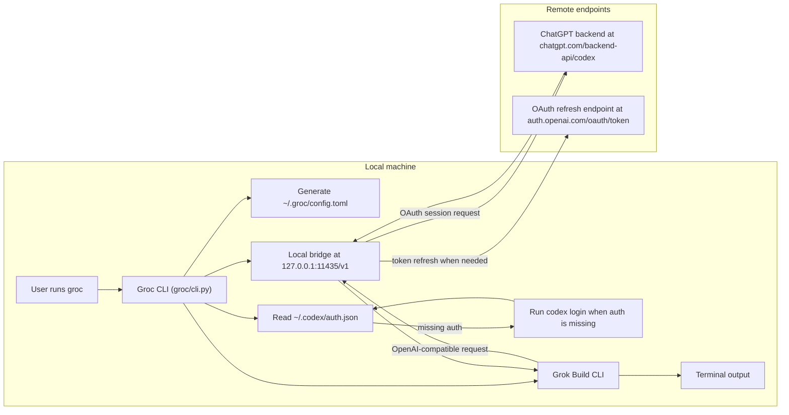

# Groc

[](https://github.com/matrixtsex/groc/actions/workflows/ci.yml)
[](https://github.com/matrixtsex/groc/actions/workflows/release.yml)
[](LICENSE)

Elon wants $300/month SuperGrok Heavy for early Grok Build access. Groc keeps
the terminal harness in your workflow with GPT-5.5 and the ChatGPT
subscription you already pay for.
If you already use Codex, this is mostly automagic: run `groc` once and it
boots the local bridge, reuses your ChatGPT auth, and drops you into Grok Build.
Groc is a local launcher and OpenAI-compatible bridge: one command starts Grok
Build with `gpt-5.5`, medium reasoning, and your existing Codex ChatGPT OAuth
session.
If your own coding benchmarks favor GPT-5.5, Groc lets you run that stronger
model in the same harness flow you already like.

Groc does not patch the Grok binary, collect credentials, or ask for an API key.
It runs on your machine, binds the bridge to `127.0.0.1`, and reuses the OAuth
file created by `codex login`.

Rollout context (as of May 15, 2026): xAI describes Grok Build as an early beta
for SuperGrok Heavy subscribers in its official launch and CLI pages
([announcement](https://x.ai/news/grok-build-cli), [CLI page](https://x.ai/cli)).
The `$300/month` SuperGrok Heavy figure was publicly reported during Grok 4
launch coverage ([TechCrunch](https://techcrunch.com/2025/07/09/elon-musks-xai-launches-grok-4-alongside-a-300-monthly-subscription/)).

## Features

- `groc` launches interactive Grok Build with professional defaults.
- `groc login` starts the normal ChatGPT OAuth login through Codex.
- `groc status` shows the active model, bridge, binary paths, and auth state.
- `groc doctor` verifies install health and prints concrete fixes.
- `groc models` lists the configured model selector entries.
- `groc models --check` verifies model access through your current subscription.
- `groc update` pulls the public repo and reinstalls the launcher.
- Local-only bridge on `http://127.0.0.1:11435/v1`.
- No OpenAI API key in Grok config.
- Tokens are read from `~/.codex/auth.json` and are never printed.
- Grok memory and web search are disabled by default.
- Subagents are enabled by default.
- Noninteractive runs filter common Grok plugin noise from stderr.
- Release archives are produced automatically from version tags.

## Why Grok Build UX

If you compare terminal agents like Claude Code and Codex CLI, Grok Build has a
few workflow traits some teams may prefer:

- Convention compatibility out of the box: xAI explicitly positions Grok Build
  to work with existing `AGENTS.md`, plugins, hooks, skills, and MCP servers.
- Strong parallel workflow framing: Grok Build emphasizes parallel subagents and
  worktree-style delegation for larger tasks.
- Built for scripting and orchestration: xAI documents headless `-p` mode and
  ACP support for automation and custom agent apps.

## Requirements

Install these first:

```text
grok
codex
python3
curl
git
```

`grok` is the Grok Build CLI. `codex` is used only for ChatGPT OAuth login.
You also need a ChatGPT subscription with access to the model you select.

## Install

From a checked-out repo:

```bash
bin/install
```

Or use the installer:

```bash
./install.sh
```

The installer writes:

```text
~/.local/bin/groc
~/.local/bin/groc-bridge
~/.groc/config.toml
~/.local/share/groc/
```

Groc regenerates `~/.groc/config.toml` at runtime so environment overrides such
as `GROC_BRIDGE_PORT` and `GROC_MODEL` stay in sync with Grok Build.

Make sure `~/.local/bin` is on your `PATH`:

```bash
export PATH="$HOME/.local/bin:$PATH"
```

Then verify the install:

```bash
groc doctor
```

If dependencies are missing, run:

```bash
groc doctor --fix
```

For non-interactive bootstrap:

```bash
groc doctor --fix --yes
```

## First Run

Launch Grok Build:

```bash
groc
```

If ChatGPT OAuth already exists in `~/.codex/auth.json`, Groc uses it. If not,
Groc runs:

```bash
codex login
```

That opens the normal ChatGPT OAuth browser flow. When login completes, Groc
continues into Grok Build.

For device login:

```bash
groc login --device-auth
```

## Daily Use

Run in a project:

```bash
groc --cwd ~/code/my-project
```

Send one prompt:

```bash
groc -p "explain this repo"
```

Pick a model:

```bash
groc -m gpt-5.4
groc -m gpt-5.3-spark
```

Pick reasoning:

```bash
groc --effort high
groc --reasoning-effort low
```

Inspect the install:

```bash
groc status
groc doctor
groc models
groc models --check
```

Update:

```bash
groc update
```

## Models

The default model is `gpt-5.5`. The default reasoning effort is `medium`.
In many engineering teams, internal evals and coding benchmarks can favor
GPT-5.5 quality for planning, edits, and reliability; Groc is built for that
path while preserving the Grok Build UX.

Configured model IDs:

```text
gpt-5.5
gpt-5.4
gpt-5.4-mini
gpt-5.3
gpt-5.3-spark
gpt-5.2
grok-build
```

`gpt-5.3` is routed upstream as `gpt-5.3-codex`.
`gpt-5.3-spark` is routed upstream as `gpt-5.3-codex-spark`.
`grok-build` is kept as a compatibility fallback for Grok CLI versions that
make internal requests under that model ID.

Check which entries work for your current subscription:

```bash
groc models --check
```

Preview without making model calls:

```bash
groc models --check --dry-run
```

## How Auth Works

Groc does not ask for an API key.

It checks:

```text
~/.codex/auth.json
```

That file is created by the Codex CLI after `codex login`. Groc loads the
ChatGPT OAuth tokens locally, refreshes them when needed, and sends authorized
requests from the local bridge to the ChatGPT backend.

Tokens are not printed and are not stored in `~/.groc/config.toml`.

## How It Works



Defaults passed to Grok Build:

```text
model: gpt-5.5
reasoning: medium
memory: off
web search: off
config home: ~/.groc
```

## Security Model

Groc is designed as a local interoperability adapter:

- The bridge binds to `127.0.0.1` by default.
- OAuth tokens stay in the Codex auth file.
- Status output redacts the account identifier.
- Backend and token refresh endpoint overrides are blocked unless explicitly
  allowed with `GROC_ALLOW_UNTRUSTED_BACKEND=1`.
- No telemetry is enabled in Groc config.

See [docs/SECURITY_MODEL.md](docs/SECURITY_MODEL.md) for the full trust model.
Users are responsible for complying with the terms of any services they connect.

## Troubleshooting

Run the doctor first:

```bash
groc doctor
```

If auth is missing:

```bash
groc login
```

If browser auth is awkward:

```bash
groc login --device-auth
```

If `grok` is not found:

```bash
GROC_GROK_BIN=/path/to/grok groc
```

If `codex` is not found:

```bash
GROC_CODEX_BIN=/path/to/codex groc login
```

If port `11435` is busy:

```bash
GROC_BRIDGE_PORT=11436 groc
```

If you want raw Grok warnings:

```bash
GROC_RAW_STDERR=1 groc -p "hello"
```

If you want Groc to fail instead of opening login:

```bash
GROC_AUTO_LOGIN=0 groc
```

## Advanced Settings

```text
GROC_HOME                         defaults to ~/.groc
GROC_MODEL                        defaults to gpt-5.5
GROC_REASONING_EFFORT             defaults to medium
GROC_BRIDGE_HOST                  defaults to 127.0.0.1
GROC_BRIDGE_PORT                  defaults to 11435
GROC_BRIDGE_LOG                   defaults to /tmp/groc-bridge.log
GROC_GROK_BIN                     defaults to ~/.local/bin/grok
GROC_AUTH_HOME                    defaults to ~/.codex
GROC_AUTO_LOGIN                   defaults to 1
GROC_CODEX_BIN                    defaults to codex
GROC_CODEX_DEVICE_AUTH            set to 1 to use codex login --device-auth
GROC_RAW_STDERR                   set to 1 to show unfiltered Grok stderr
GROC_REPO_URL                     defaults to https://github.com/matrixtsex/groc.git
GROC_UPDATE_DIR                   defaults to ~/.local/share/groc-src
GROC_UPSTREAM_MODEL               fallback upstream model, defaults to gpt-5.5
GROC_BACKEND_BASE_URL             dangerous; requires GROC_ALLOW_UNTRUSTED_BACKEND=1
GROC_REFRESH_TOKEN_URL_OVERRIDE   dangerous; requires GROC_ALLOW_UNTRUSTED_BACKEND=1
GROC_ALLOW_UNTRUSTED_BACKEND      opt in to endpoint overrides
```

## Development

Run the local quality gate:

```bash
make verify
```

That compiles the Python package, runs unit tests, checks shell syntax, prints
the CLI version, and dry-runs model verification.

Package locally:

```bash
scripts/package-release.sh v0.1.0
```

## Project Layout

```text
bin/groc                    small launcher shim
bin/groc-bridge             small bridge shim
bin/install                 local installer
groc/                       Python package
groc/cli.py                 product CLI and Grok launcher
groc/grok_config.py         runtime Grok config renderer
groc/auth.py                Codex ChatGPT OAuth loading and refresh
groc/bridge/server.py       local OpenAI-compatible HTTP bridge
groc/bridge/client.py       ChatGPT backend client
groc/bridge/wire.py         request and response conversion
tests/                      unit tests for product logic
docs/                       architecture and security notes
```

## Scope

Groc does not patch or modify Grok Build. It uses Grok Build's normal custom
model configuration and points it at a local bridge controlled by the user.
